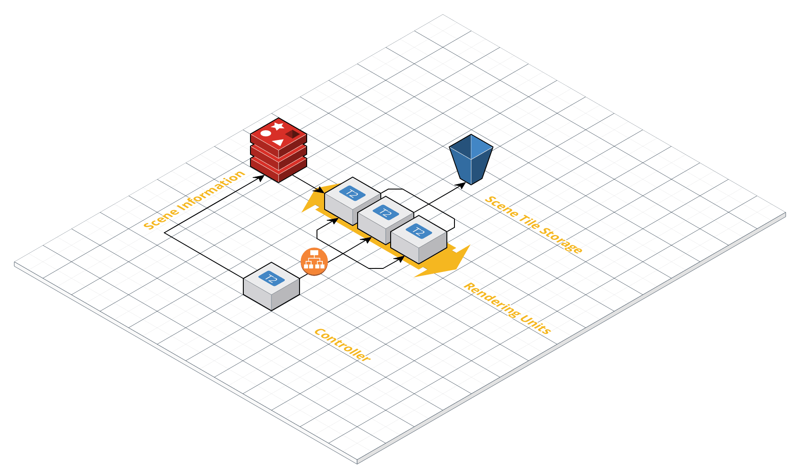
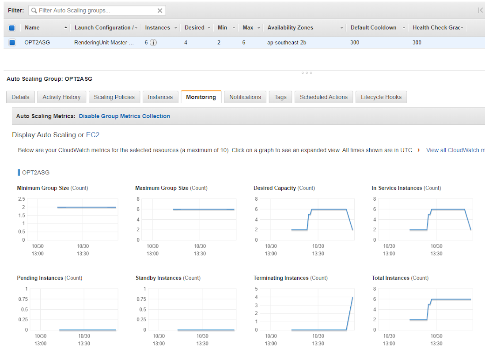
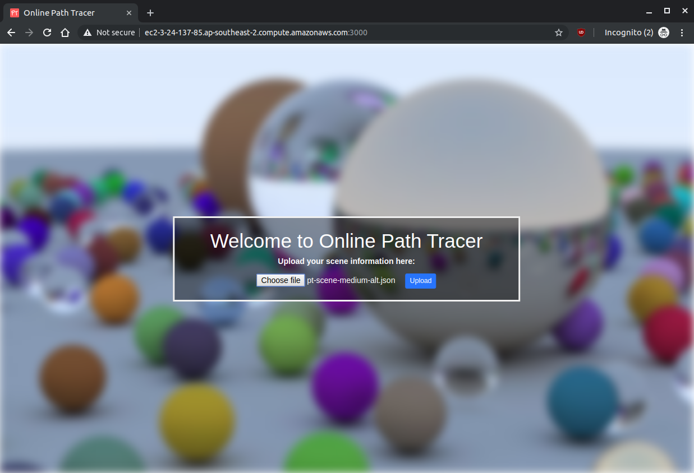
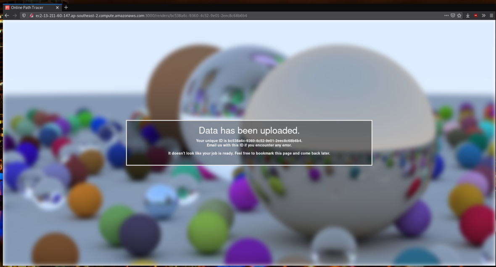
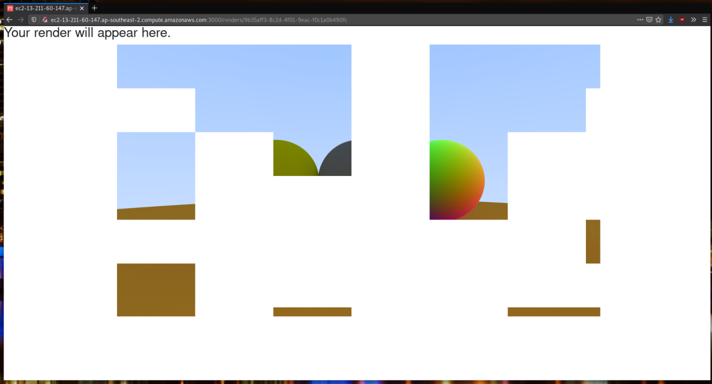
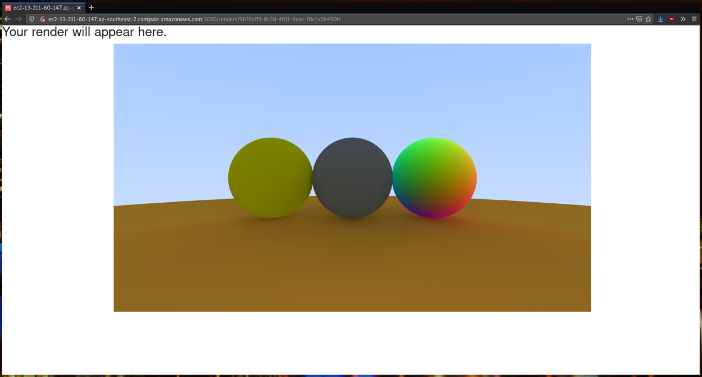

# Online Path Tracer 
This repository hosts the source code for an online path tracing service which we developed for the final assignment of a cloud computing unit we took at university. 

The focus of this assignment was scalability and persistence. 
The underlying path tracer is very basic and not even multi-threaded, but produces sufficient CPU load that scalability is able to  be demonstrated.

## Architecture


### How it works
The controller serves a frontend website which lets a user upload a JSON file specifying the scene information. 
From here, the controller splits the render into a number of equally-loaded tiles and posts each tile to an internal load balancer sitting in front of a number of rendering units. 
When each rendering unit is done, it puts the rendered image tile into a bucket. When the user goes to see their final render, their browser will make the appropriate requests to the bucket directly and stitch together the image tiles into a proper image using a HTML5 canvas.

### Scaling 
We wrote the application to be as stateless as possible, and thus we're able to scale in two places. First, the frontend controller can sit behind an internet-facing load balancer, which lets us scale in the (albeit theoretical) event that lots of people are using the service at once. We are also able to scale the internal rendering units, in the event that lots of renders are on-going at once (or someone submits a very complex render).

### Cloud Services Utilised
Microsoft Azure  
- Azure Cache for Redis — for storing scene information.

Amazon Web Services  
- Load Balancer — distributes rendering tasks to 1 or more instances.  
- EC2 Instances — 1 for serving frontend and 2 or more for rendering units.  
- Auto Scaling Group — for scaling our instances based on a defined scaling policy.  
- S3 Bucket — for longer-term storage of metadata and image tiles.   

You might note that using a managed Redis service to just hold scene information is a bit of an odd (and expensive) choice, when we could easily store this in the AWS bucket, alongside the metadata. This is because we were required to use at least two "levels" of persistence, and decided to shoehorn the Redis cache here.

Another odd choice here is to deploy our rendering units on EC2 micros rather than something more powerful (and with more threads): again, this is due to the requirements of the assignment.

## Tested environment

Scaling Policy  
- Average CPU utilisation > 40%  

Initial number of instances  
- Minimum 2, maximum 6

### Scaling result
 

### Example of submitting, rendering and receiving the image
  
  
  


## How to run this repo locally
Running locally means we can skip certain web service deployments such as load balancer and auto scaling group.

Controller will still split the render into multiple tiles, but only one rendering unit will be computing the render (even if you have more than one rendering unit running). Talk to us if you wish to see a cloud-based how-to-run. 

You will need  
- An S3 bucket
- A Redis cache (local or managed)

First, launch the rendering unit:

```sh
cd rendering-unit/ 
PORT=3001 npm start &
cd ../
```
Next, Change the environment vars specified in`controller/launch.sh` to point to your Redis cache and S3 bucket. 
```sh
...
export RUIP="http://localhost:3001" # The IP of the rendering unit (or load balancer IP).
export AWSBUCKETNAME=your-bucket-name
export REDISCACHEHOSTNAME=localhost
export REDISCACHEKEY=your-redis-key-or-blank
export CACHEPORT=6379
...
```

Then, launch the controller using `controller/launch.sh`:
```sh
cd controller/
./launch.sh

```

# Future Work
- Graphical scene editor
- HTTPS
- Upgrade the underlying path tracing engine
- Switch to TypeScript

